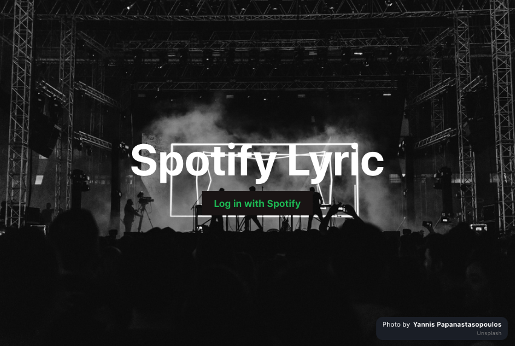
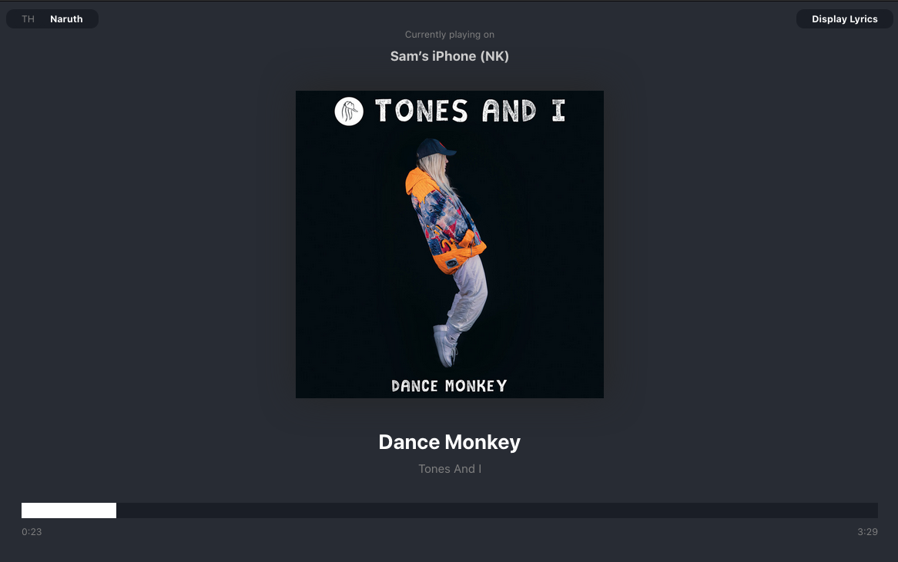

# Spotify Lyrics

Show currently playing song and its lyric

## Installation

To be updated

## Running the App

To be updated

### Server

To be updated

### Client 

#### `npm start`

Runs the app in the development mode. 
Open [http://localhost:3000](http://localhost:3000) to view it in the browser.

## Areas of Improvements

- Logout function
- Unit tests coverage
- Player controls
- Improve progress bar
- UI enhancement